# AppUI-Stub

Collection of reusable UI views original designed for a social network/connections application based on Boostraps' [Bare](http://startbootstrap.com/template-overviews/bare/) template.

## Getting Started

To begin using this template, choose one of the following options to get started:
* Clone the repo: `git clone https://github.com/ernstmelias/APPUI.git`
* Fork the repo

## Bugs and Issues

Have a bug or an issue with this template? [Open a new issue](https://github.com/ernstmelias/APPUI/issues) here on GitHub. 

## Account
* A user account managment page.
* account.html
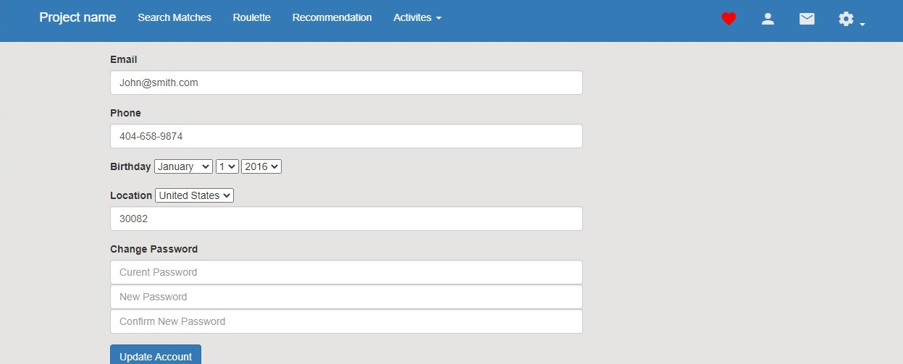

## Connections
* A page for  list of friends.
* connections.html
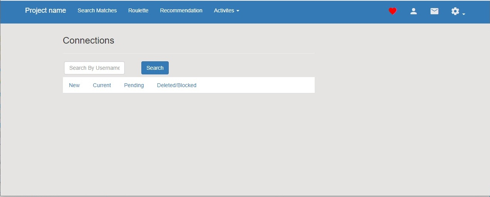

## Dash
* User dashboard.
* dash.html
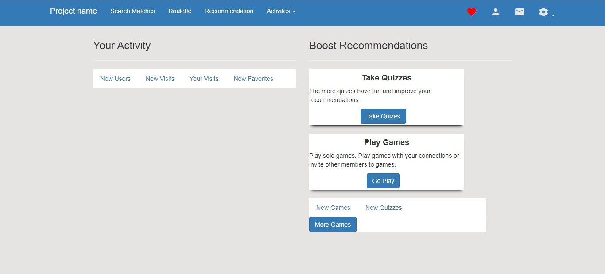

## Favorites
* List of favorite friends/requests.
* favorites.html
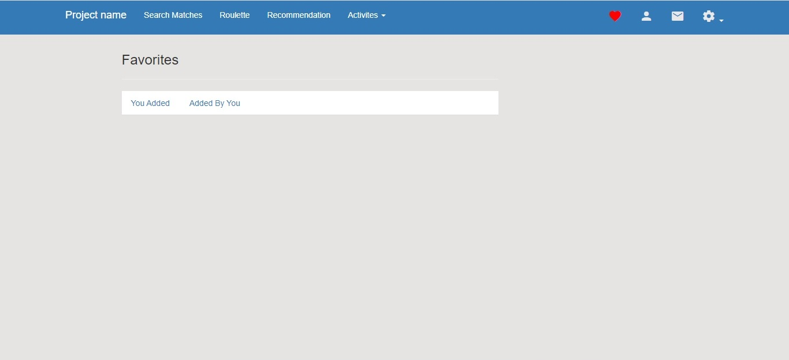

## Forgot Password
* Recover password screen.
* forgot.html
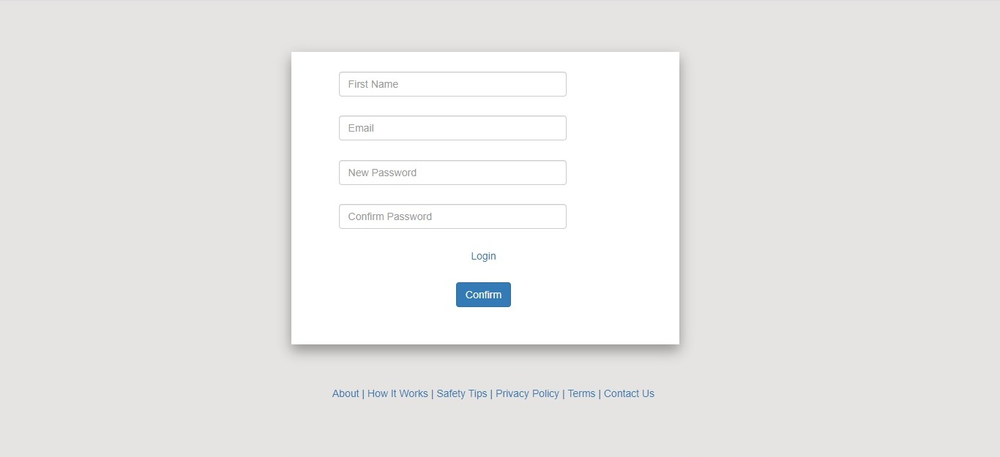

## Forgot Username
* Recover username screen.
* forgotuser.html
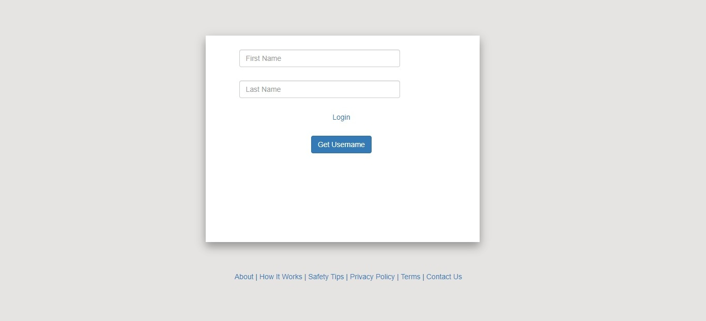

## Games
* Home page of available games.
* games.html
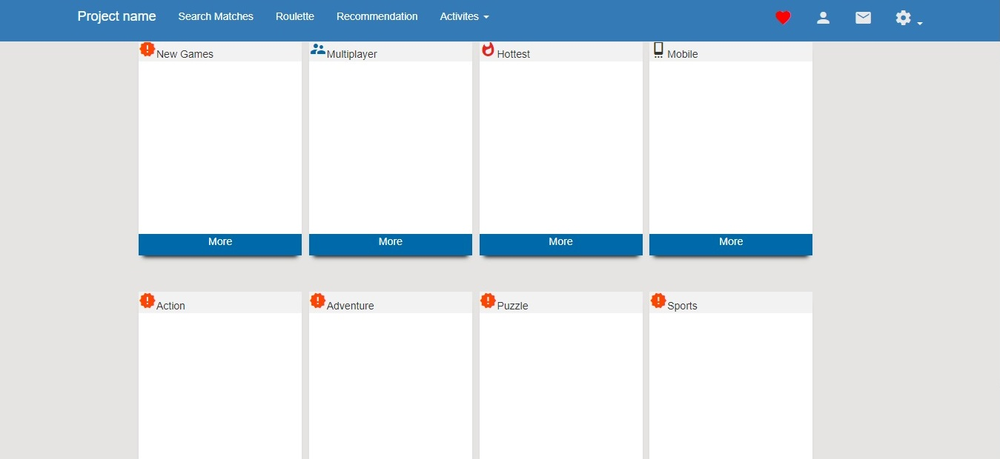

## Index
* Welcome screen.
* index.html
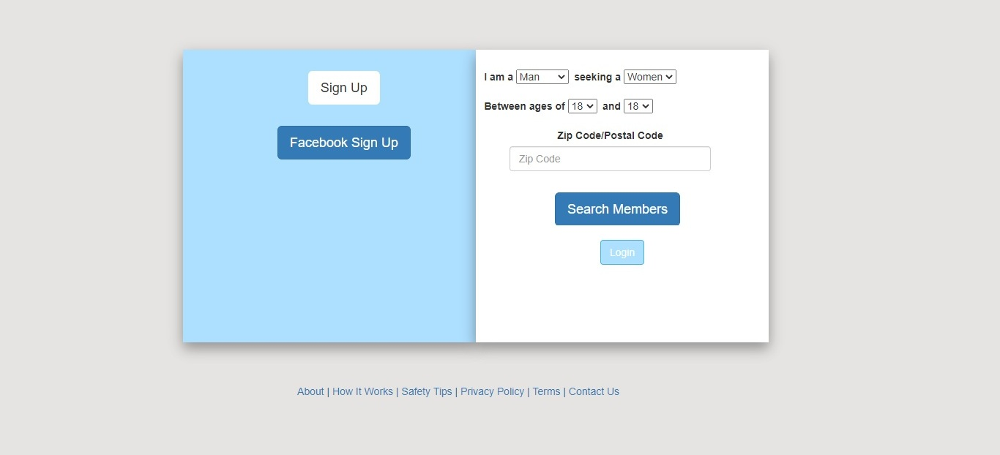

## Login
* Login screen.
* login.html
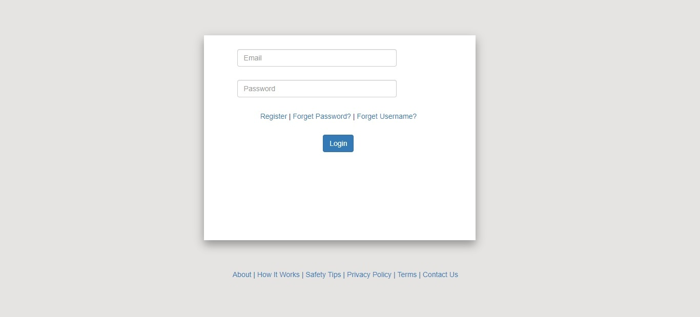

## Messages
* Sent/Received messages.
* messages.html
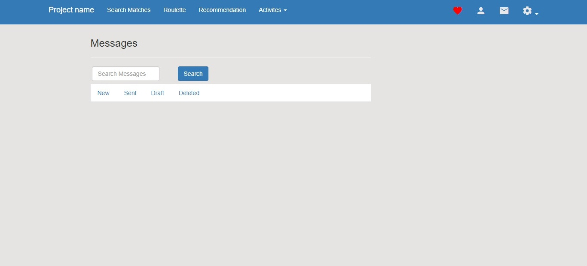

## Profile
* User profile screen.
* profile.html
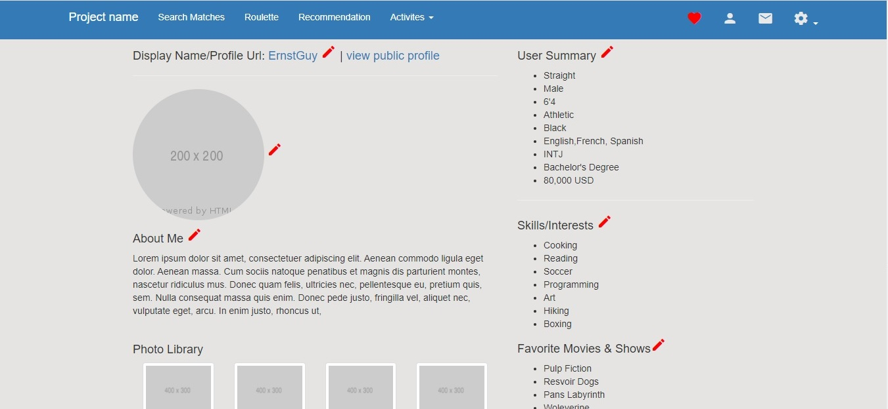

## Register
* Register screen.
* register.html
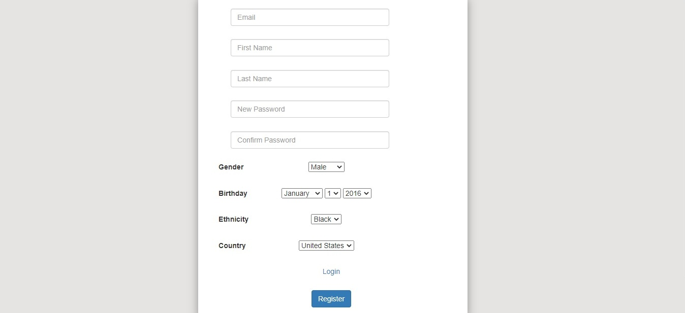

## Roulette
* Roulette connection.
* roulette.html
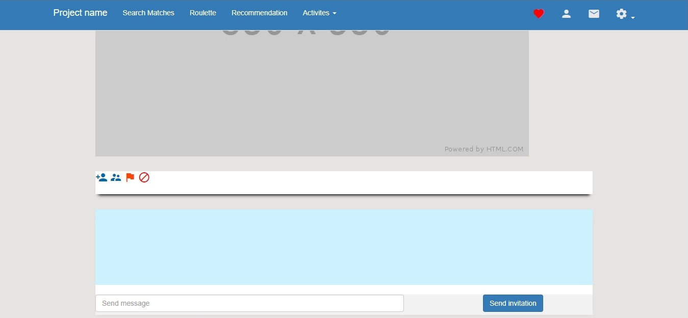

## Subscription
* SubScription screen setup.
* subscription.html
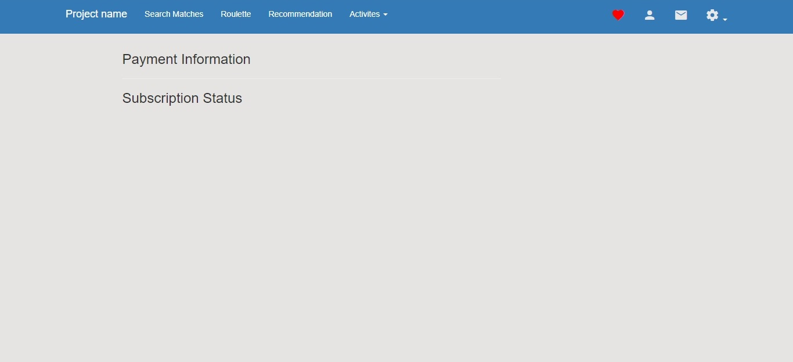

## FAQ
* Boostrap
* HTML
* CSS
* JavaScript

## LICENSE
* [ MIT License ](http://badges.mit-license.org)